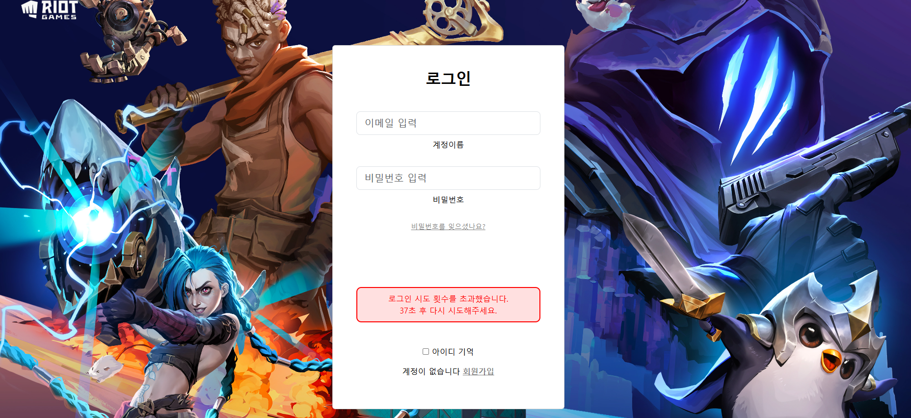
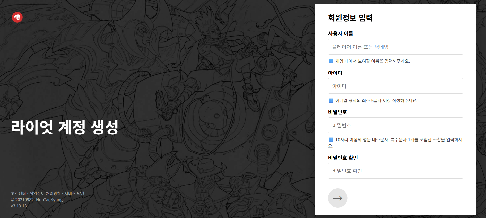
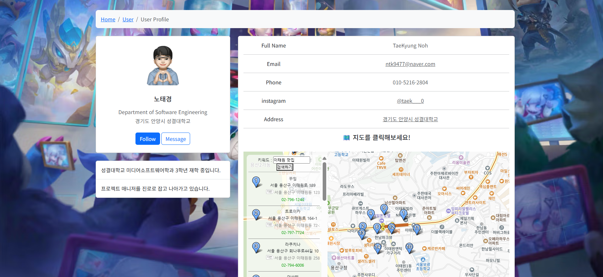

## 2주차 수업 : 메인화면 완료
- 추가문제 : 주제 선정, 데이터 수정 완료: lol 홈페이지 

## 3주차 수업 : 부트스트랩 적용 완료
- 추가문제 : 네비 드랍다운 메뉴 하이퍼링크 수정, 테이블 색상 적용완료

## 4주차 수업 : JS 적용 완료
- 추가문제 : search.js 수정 완료

## 5주차 수업 : JS이용하여 팝업창 띄우기
- 추가문제 : 검색창 문자열 검사 - 공백, 비속어 5개

## 6주차 수업 : 로그인 폼 
- 추가문제 : 로그아웃 버튼 기능 구현 완료

## 7주차 수업 : 중간고사 정리

## 8주차 수업 : 중간고사 

## 9주차 수업 : 로그인폼 - 입력 길이와 특수문자, XSS 방지
- 추가문제 : 로그인 입력 길이 제한, 로그인 입력 제한 방지

## 10주차 수업 : 데이터 저장
- 추가문제 : 로그인 실패 횟수가 3번인 경우 로그인 제한 및 로그아웃 시 세션 삭제

## 11주차 수업 : 데이터 저장 - 암호화
- 추가문제 : 로그아웃 시 JWT 토큰 삭제, 뒤로가기 버튼 눌러도 로그인 상태 유지 안 됨됨

## 12주차 수업 : 회원가입 
- 추가문제 : 회원가입 후 암호화 된 객체 저장 완료

## 13주차 수업 : 지도
- 추가문제 : 좌표로 주소 출력하기 완료

## ✨ 추가 구현 기능(기존 LOL page 참고)

### 1. 메인화면
- 메인 배경 또는 상단에 동영상 삽입
- OP.GG 전적표 이미지 첨부 (클릭 시 해당 페이지로 이동 가능)

### 2. 네비게이션 바
- 디자인 리뉴얼
- 메뉴 항목 하이퍼링크 적용
  - 다운로드
  - E스포츠
  - 유니버스
  - 라이엇스토어
  - 고객지원
- 드롭다운 메뉴 기능 추가
  - 게임정보 / 새소식 / 알아보기 메뉴에 드롭다운 구현
  - 마우스 hover 시 드롭다운 표시 및 배경 색상 변경
- 검색 기능 개선
  - 돋보기 버튼 클릭 시 자연스럽게 검색창 등장
  - 엔터 키 입력 시 검색 실행

### 3. 로그인 기능
- 입력 유효성 검사:
  - 이메일 형식 확인
  - 아이디: 최소 5자 이상
  - 비밀번호: 10자 이상 + 특수문자 1개 + 대소문자 포함
- 로그인 제한 기능:
  - 로그인 3회 실패 시 버튼 숨김
  - 1분 후 재시도 가능 (초 단위로 상태 메시지 출력: "@초 후 다시 시도해주세요.")
  - 2회 실패 시 "한 번의 시도 기회가 남았습니다" 알림창 출력
  - 로그인 성공 시 알림창 출력

### 4. 로그인 페이지 스타일
- 배경 이미지 추가
- 로그인 버튼 클릭 시 색상 전환 (검정 → 빨간색)

### 5. 회원가입 페이지 기능 및 스타일
- 배경 이미지 추가
- 화살표 버튼 클릭 시 색상 전환 (회색 → 빨간색)
- 조건 만족 시: "사용자 이름님 안녕하세요" 알림창 출력
- 조건 미달 시: 경고 알림창 출력

### 6. 기타 UI 개선
- 팝업 스타일 개선 (모서리 둥글게, 배경 흐림 등)
- 프로필 UI 정렬 및 이미지 사이즈 통일

## 페이지 화면
- 메인 페이지

- 로그인 페이지

- 회원가입 페이지

- 프로필 페이지

